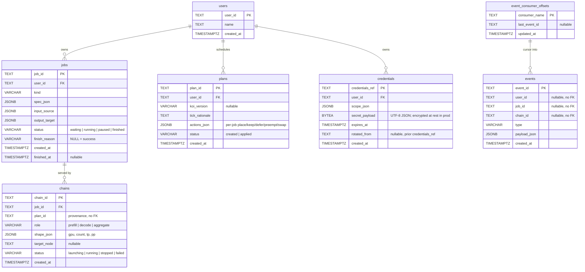

# Database

Visual reference for the canonical Postgres spine implemented by
`tandemn_system_data`. Mirrors `DATA_ARCHITECTURE.md` §5.

This file is the no-install path; for live exploration of data, use
DBeaver (see [Live exploration](#live-exploration) below).

---

## Entity-relationship diagram

Tables, primary keys, foreign keys, and the columns that carry meaning
beyond timestamps and statuses. JSONB columns are flagged with `(jsonb)`.



Not tables, on purpose:

- **resource map** — Orca's in-memory state (`ResourceMap` wire contract);
  updated when jobs reserve/release capacity, never by polling clouds.
- **koi ticks** — `tick.started` / `tick.completed` events; `tick_id` is a
  correlation string.
- **ranks / ladders** — live inside `plans.actions_json`; no traversal in
  the MVP, Orca gang-launches what a placement describes.

---

## Foreign-key map

The same graph in text, useful for grep and for non-Mermaid renderers.

```
users(user_id)   ← jobs.user_id          CASCADE
users(user_id)   ← plans.user_id         CASCADE
users(user_id)   ← credentials.user_id   CASCADE

jobs(job_id)     ← chains.job_id         CASCADE
```

`chains.plan_id` is provenance only (no FK): plans and chains have
independent lifecycles.

`events` deliberately has **no** foreign keys to `jobs` / `chains` /
`users` — the audit log must survive cascade deletes of upstream rows.
Consumers track their own cursor in `event_consumer_offsets` and update it
only after successful processing.

---

## Read it in one sentence

> A **user** submits **jobs** (status `waiting`); each Koi pass produces a
> **plan** — a rationale plus per-job actions (`place`, `keep`, `defer`,
> `preempt`, `swap`); Orca applies the actions, gang-launching the
> **chains** a placement describes (prefill + decode together for PD);
> every state change emits an **event** into the durable audit log;
> **credentials** are short-lived, scoped secrets the worker resolves at
> fetch time.

---

## Indexes worth knowing

Defined in `tandemn_system_data/db/orm.py`:

- `jobs`: (user_id, created_at); (status)
- `plans`: (user_id, created_at); (status)
- `chains`: (job_id); (status)
- `events`: (job_id, created_at); (chain_id, created_at); (user_id, created_at); (type, created_at) — supports the "show me everything about job_xyz" query in DATA_ARCHITECTURE.md §12
- `event_consumer_offsets`: primary key on `consumer_name`
- `credentials`: (user_id); (expires_at)

---

## Live exploration

For data browsing, query history, and an interactive ERD, install DBeaver
and connect to the docker-compose Postgres:

```bash
brew install --cask dbeaver-community   # macOS
# Linux/Windows: https://dbeaver.io/download/
```

Then create a new PostgreSQL connection:

| Field    | Value     |
|----------|-----------|
| Host     | localhost |
| Port     | 55432     |
| Database | tandemn   |
| User     | tandemn   |
| Password | tandemn   |

Once connected, right-click the `public` schema → **View Diagram** for
the auto-generated ERD with the same shape as the Mermaid diagram above,
but interactive (drag/zoom/export PNG/SVG).

To browse the schema from the command line instead:

```bash
make migrate            # ensure the latest schema is applied
docker exec -it tandemn-postgres psql -U tandemn -d tandemn -c "\dt"
docker exec -it tandemn-postgres psql -U tandemn -d tandemn -c "\d+ chains"
```
