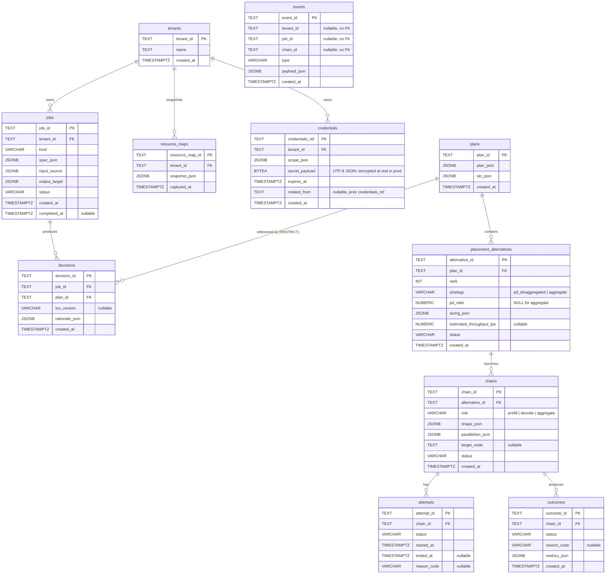

# Database

Visual reference for the canonical Postgres spine implemented by
`tandemn_system_data`. Mirrors `DATA_ARCHITECTURE.md` §5.

This file is the no-install path; for live exploration of data, use
DBeaver (see [Live exploration](#live-exploration) below).

---

## Entity-relationship diagram

Tables, primary keys, foreign keys, and the columns that carry meaning
beyond timestamps and statuses. JSONB columns are flagged with `(jsonb)`.



---

## Foreign-key map

The same graph in text, useful for grep and for non-Mermaid renderers.

```
tenants(tenant_id)               ← resource_maps.tenant_id           CASCADE
tenants(tenant_id)               ← jobs.tenant_id                    CASCADE
tenants(tenant_id)               ← credentials.tenant_id             CASCADE

jobs(job_id)                     ← decisions.job_id                  CASCADE
plans(plan_id)                   ← decisions.plan_id                 RESTRICT
plans(plan_id)                   ← placement_alternatives.plan_id    CASCADE

placement_alternatives(alt_id)   ← chains.alternative_id             CASCADE
chains(chain_id)                 ← attempts.chain_id                 CASCADE
chains(chain_id)                 ← outcomes.chain_id                 CASCADE
```

`events` deliberately has **no** foreign keys to `jobs` / `chains` /
`tenants` — the audit log must survive cascade deletes of upstream rows.
This is the §8 "CP record alongside AP delivery" pattern.

---

## Read it in one sentence

> A **tenant** submits **jobs**; Koi produces a **decision** for each job
> that points at a **plan**; a plan carries ordered **placement
> alternatives** (with `pd_ratio` for PD-disaggregated, NULL for
> aggregate); each alternative launches **chains** (with role
> prefill / decode / aggregate); each chain has **attempts** and produces
> **outcomes**; every state change emits an **event** into the durable
> audit log; **credentials** are short-lived, scoped secrets the worker
> resolves at fetch time.

---

## Indexes worth knowing

Defined in `tandemn_system_data/db/orm.py`:

- `resource_maps`: GIN(`snapshot_json` jsonb_path_ops) for hierarchical inventory queries; (tenant_id, captured_at)
- `jobs`: (tenant_id, created_at); (status)
- `decisions`: (job_id); (plan_id)
- `placement_alternatives`: (plan_id, rank) — the natural order for fallback traversal
- `chains`: (alternative_id, role); (status)
- `attempts`: (chain_id)
- `outcomes`: (chain_id)
- `events`: (job_id, created_at); (chain_id, created_at); (tenant_id, created_at); (type, created_at) — supports the "show me everything about job_xyz" query in DATA_ARCHITECTURE.md §12
- `credentials`: (tenant_id); (expires_at)

---

## Live exploration

For data browsing, query history, and an interactive ERD, install DBeaver
and connect to the docker-compose Postgres:

```bash
brew install --cask dbeaver-community   # macOS
# Linux/Windows: https://dbeaver.io/download/
```

Then create a new PostgreSQL connection:

| Field    | Value     |
|----------|-----------|
| Host     | localhost |
| Port     | 55432     |
| Database | tandemn   |
| User     | tandemn   |
| Password | tandemn   |

Once connected, right-click the `public` schema → **View Diagram** for
the auto-generated ERD with the same shape as the Mermaid diagram above,
but interactive (drag/zoom/export PNG/SVG).

To browse the schema from the command line instead:

```bash
make migrate            # ensure the latest schema is applied
docker exec -it tandemn-postgres psql -U tandemn -d tandemn -c "\dt"
docker exec -it tandemn-postgres psql -U tandemn -d tandemn -c "\d+ chains"
```
