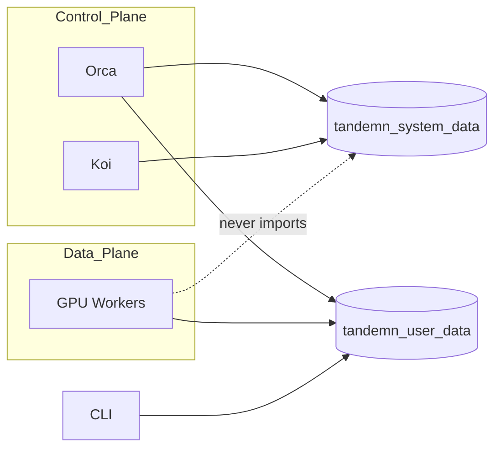
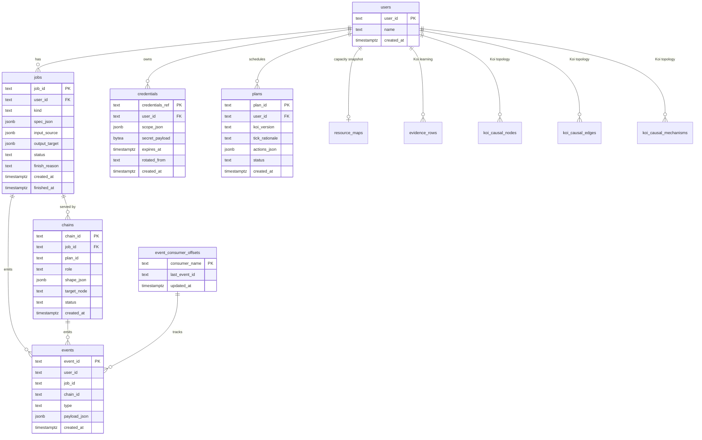
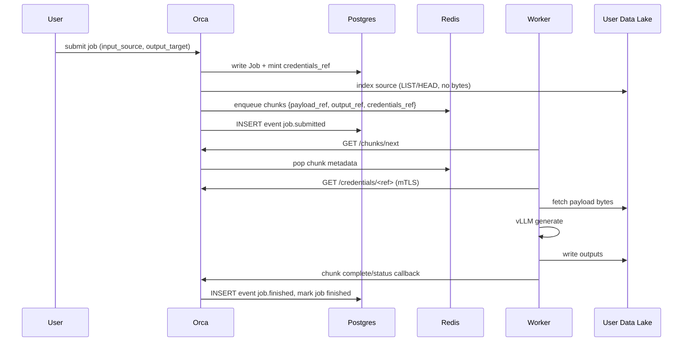
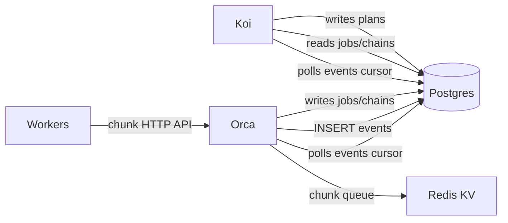
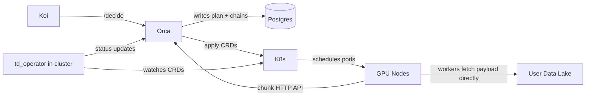

# Tandemn Data Architecture

This document describes how Tandemn stores, moves, and shares data
across its services. It is written from first principles. No history,
no migration narrative — just the model.

Tandemn is a control plane for LLM inference. Two services do the work:

- **Koi** — the brain. Computes placement plans and learns from outcomes.
- **Orca** — the executor. Launches chains, runs batch and online inference, records what happened.

Plus the workers (vLLM processes on GPU nodes) and the user's data systems
(S3, Snowflake, BigQuery, on-prem object stores, etc.).

The data architecture exists so these pieces share the same truth without
stepping on each other.

---

## 1. Principles

1. **One source of truth.** Canonical entities live in Postgres. Everything else (Redis, S3, logs, metrics) references those rows.
2. **Two libraries, not one.** User data and system data have different consumers, different security models, and different release cadences. Keep them separate.
3. **Workers are dumb.** Workers process chunks. They do not hold canonical state, do not query Postgres, and do not hold long-lived customer credentials.
4. **Data does not transit Orca.** Orca emits pointers; workers fetch bytes directly from the user's data system.
5. **Postgres is the source of truth and event log.** Events are rows in Postgres. Koi/Orca consume them by cursor/polling; Redis Streams are not required for the MVP.
6. **No new tables for new sources.** A new data lake connector is one PR, zero schema migrations.

---

## 2. The Two Libraries



### `tandemn_system_data` — canonical state

Owns: Postgres models, SQLAlchemy ORM, Alembic migrations, event log,
IDs, event envelope, `CredentialStore`, and the worker-facing credentials
HTTP endpoint (`create_credentials_app`).

Imported by **Orca and Koi only**. Workers never import it.

### `tandemn_user_data` — user payloads in motion

Owns: `PayloadRef` / `OutputRef` / `NormalizedRecord` types, connector
protocol, connectors (`S3Connector`, future
Snowflake/BigQuery/GCS/Azure/Kafka/etc.), and the worker-side credential
resolver (`HttpCredentialResolver`). Orca mints credentials through
`tandemn_system_data`; workers resolve them over HTTP at fetch time.

Imported by **Orca, workers, and CLI**.

The split is enforced in CI (`import-linter`) so a worker module can't
accidentally pull in `tandemn_system_data`.

---

## 3. Storage Substrates

Each substrate has one job and is chosen for what it's good at.

| Substrate          | Role                                            | CAP        |
|--------------------|-------------------------------------------------|------------|
| Postgres           | Canonical spine. All entity rows, audit log.    | CP         |
| Postgres events    | Durable event log and consumer cursors.         | CP         |
| Redis KV           | Deferred (Phase 2): hot chunk queue for distributed workers. | AP      |
| S3 / MinIO         | Deferred: Tandemn-owned artifacts; staging.     | AP + strong RAW |
| User data systems  | Source/sink for inference inputs and outputs.   | n/a (theirs)|

The mental model: **truth and events live in Postgres; bytes live in S3
or in the user's lake; hot chunk queues may live in Redis when Phase 2
needs them.**

---

## 4. Canonical Hierarchy

```
user_id
  └── job_id             (waiting | running | paused | finished)
  │     └── chain_id     (role: prefill | decode | aggregate)
  └── plan_id            (rationale + per-job actions, produced by a Koi pass)
```

Everything else is an **event**, not an entity:

- A Koi scheduler pass ("tick") is recorded as tick.started /
  tick.completed events; `tick_id` is a correlation string.
- Chain launch attempts and outcomes are chain.* and job.* events.
- Ladders (ordered rank configs with expected TPS) live inside the
  plan's `actions_json` — there is no ranks table and no traversal in
  the MVP.

---

## 5. The Spine (Postgres)



Full column reference (indexes, status values): `DATABASE.md`.

Key column notes:

- `jobs.input_source` and `jobs.output_target` are JSONB. They describe
  *where* user data lives, never the data itself.
- `jobs.status` is exactly `waiting | running | paused | finished`. New
  jobs start `waiting`. `finish_reason` is NULL on success, a reason
  code (FAILED, CANCELLED, ...) otherwise.
- A `plan` is one Koi pass's decision: a cluster-wide `tick_rationale`
  plus `actions_json`, a list of per-job actions
  (`place | keep | defer | preempt | swap`). Ladders — ordered rank
  configs with expected TPS — live inside the actions, not in tables.
  What Koi saw (job counts, resource map version) belongs in the
  rationale.
- `chains.job_id`: chains are job-scoped (plan actions are per-job).
  `chains.plan_id` is provenance only, no FK.
- `chains.shape_json` carries hardware and parallelism together:
  `{"gpu": "H100", "count": 8, "tp": 2, "pp": 4}`. Prefill and decode
  chains of the same job may have different shapes.
- `credentials.secret_payload` is encrypted at rest. Workers never read this table directly.
- `event_consumer_offsets` tracks each consumer's cursor into the Postgres
  event log. Consumers update their cursor only after successful processing.
- `resource_maps`: one live snapshot per user. `pools_json` stores
  `{capacity_type, clouds}` — hierarchical capacity (see §6). Orca
  `replace`s with a bumped `version`; Koi `get`s.
- `evidence_rows` and `koi_causal_*`: Koi-only durability (see §6). Not Orca
  handoff surfaces. Full column reference: `DATABASE.md`.

---

## 6. Koi Passes and Plan Actions

Full integration checklist: [`docs/KOI_INTEGRATION.md`](./docs/KOI_INTEGRATION.md).

Koi runs a scheduler pass whenever it decides the cluster needs a new
decision — on a timer, after relevant events, or on demand. The trigger
is a Koi implementation detail; this contract only requires that each
pass produces one `plan`. Each pass looks at:

- waiting jobs and running jobs (Postgres, via `JobStore`: running jobs
  carry the active chains serving them)
- paused jobs (preempted; candidates to resume)
- the current resource map (Postgres `resource_maps` per user)

The resource map is **not** refreshed by polling cloud providers. For the
MVP it reflects the capacity reservations the user already holds; Orca
updates it when a job reserves or releases resources (place / preempt /
swap / finish). Orca's reconciler is its single writer; one row per
``user_id`` in ``resource_maps`` with a monotonic ``version`` and
``pools_json`` (``capacity_type`` + ``clouds``; same wire shape as
``ResourceMap``).

Wire shape (abbreviated):

```jsonc
{
  "version": 2,
  "updated_at": "...",
  "capacity_type": ["reserved"],
  "clouds": {
    "aws": {
      "regions": {
        "us-east-2": {
          "zones": {
            "use2-az3": {
              "network_fabrics": {
                "efa-cluster-a": {
                  "fabric_type": "efa",
                  "gpu_direct_rdma": true,
                  "machine_pools": {
                    "g6e.12xlarge": {
                      "gpu_type": "L40S",
                      "gpus_per_instance": 4,
                      "total_instances": 8,
                      "available_instances": 3
                    }
                  }
                }
              }
            }
          }
        }
      }
    }
  }
}
```

Orca updates ``available_instances`` on place / preempt / swap / finish.
Koi reads the tree via ``ResourceMapStore.get`` and flattens GPU capacity
with ``ResourceMap.scheduling_summary()`` (env_key =
``cloud|region|zone|gpu_type``).

The pass produces one `plan`: a cluster-wide rationale plus one action
per job it considered:

```jsonc
{
  "tick_rationale": "<1-3 paragraph cluster-wide reasoning>",
  "actions": [
    {"job_id": "B", "type": "place",                 // waiting -> running
     "ladder": [{"prefill": {"gpu": "H100", "count": 8, "chains": 2}},
                 {"decode":  {"gpu": "A100", "count": 8, "chains": 1}}],
     "target_tps": 1500},
    {"job_id": "C", "type": "keep"},                 // stay running
    {"job_id": "D", "type": "defer"},                // stay waiting
    {"job_id": "E", "type": "preempt"},              // running -> paused
    {"job_id": "F", "type": "swap",                  // relaunch elsewhere
     "ladder": [...]}
  ]
}
```

The handoff goes through `PlanStore` (`tandemn_system_data.clients`):
Koi `create`s the plan; Orca polls `unapplied`, applies the actions,
and `mark_applied`s it (compare-and-set, so a plan is applied once).

Orca applies the actions — **no traversal in the MVP**. A placement is
gang-scheduled: if Koi says 2 prefill chains on 8xH100 and 1 decode
chain on 8xA100, Orca launches all of it at once
(`JobStore.launch_chains`, one transaction) and records one job-scoped
chain row per launched chain. Expected TPS lives inside the
ladder JSON for Koi's own bookkeeping; the database stores no
throughput numbers.

### Koi evidence (`evidence_rows`)

Koi emits `EvidenceRow` records (`tandemn_system_data.models`) per
(tick, job, rank) during a pass and persists them via `EvidenceStore`.
Before each new pass Koi reads ``EvidenceStore.recent(user_id,
last_n_ticks=10)`` (or more) to feed CUSUM/ICP and surrogate updates.

Indexed columns: `row_id`, `user_id`, `tick`, `job_id`, `rank_id`,
`deploy_timestamp_utc`; heavy fields live in `payload_json`. Not an Orca
handoff surface. `rank_id` is a Koi ladder-step key, not a spine `ranks`
table.

### Koi causal graph (`koi_causal_*`)

Koi persists its candidate-graph topology and Beta confidence in three
Postgres tables per user: ``koi_causal_nodes``, ``koi_causal_edges``,
``koi_causal_mechanisms``. Edge and mechanism confidence metadata
(alpha/beta, visit counts, Q histograms) are co-located with topology
rows — not separate tables.

Koi loads via ``CausalGraphStore`` at boot (seed from JSON once if empty),
keeps hot-path state in memory during a tick, and flushes confidence
updates back with ``sync_edge_metadata`` / ``sync_mechanisms`` after S3
writes. Not an Orca handoff surface.

---

## 7. User Data Path

User data never transits Orca during execution.

The diagram below is the **Phase 2** target (Redis chunk queue +
`/chunks` API). In the MVP, Orca hands chunk metadata to workers
directly — skip the Redis and `GET /chunks/next` steps.



Two type-level constructs:

```
PayloadRef       = { type, uri, byte_range?, format, credentials_ref }
OutputRef        = { type, uri, format, credentials_ref }
NormalizedRecord = { input_id, user_id, job_id, prompt, metadata }
```

The connector framework (`tandemn_user_data/connectors/`) is the only
place that knows about S3, Snowflake, GCS, etc. Everything downstream
sees `NormalizedRecord`s and `PayloadRef`s.

Workers resolve `credentials_ref` to short-lived, scoped tokens via a
narrow Orca endpoint. They **never** hold long-lived customer credentials.

---

## 8. Communication and Shared Memory

Services do not call each other directly for state-bearing operations.
They share state through the spine and notify each other through events.



### Shared memory (Postgres)

Every entity Orca or Koi cares about exists as a Postgres row with a
canonical ID. To learn what's true, a service reads. To change what's
true, a service writes a row. No service holds canonical state in
local memory.

### Event log (Postgres)

When state changes, the writer inserts an event row into Postgres. Koi
and Orca consume events by reading rows after their own cursor in
`event_consumer_offsets`. If Koi is down when Orca records `chain.failed`,
the row remains in Postgres and Koi catches up when it restarts.

Postgres is both the durable audit log and the MVP delivery mechanism.
Redis Streams can be added later if event latency, fanout, or consumer
group scaling requires it.

### Work queue (Redis KV) — deferred to Phase 2

When the chunk queue lands it will be Redis-backed, but workers will not
talk to Redis directly. Workers call Orca's chunk HTTP API; Orca uses
Redis internally for queue state. The queue holds metadata, not bytes.
Neither the queue nor the HTTP endpoints exist in the MVP.

### What replaces webhooks

Old direct webhook calls (`/job/complete`, `/job/replica-failed`,
`/job/config-attempted`) become event rows in Postgres. The
webhook endpoints survive as thin shims that translate inbound HTTP to
canonical events, for any client that still posts to them.

---

## 9. Event Catalog (MVP)

```
job.submitted    job.placed      job.paused     job.resumed    job.finished
tick.started     tick.completed
plan.created     plan.applied
chain.launched   chain.running   chain.stopped  chain.failed
```

`job.finished` carries `finish_reason` (None = success). Launch
attempts and outcomes are events, not tables.

Each event carries the canonical IDs (`user_id`, `job_id`,
`chain_id?`) plus a typed payload. Consumers are idempotent on
`event_id`.

---

## 10. Kubernetes Migration — and why nothing here changes

Tandemn is moving from SkyPilot/bare-metal launches to Kubernetes. A
new component, **`td_operator`**, runs inside the customer's cluster
(EKS / GKE / OKE / on-prem k8s) and reconciles **Tandemn Custom
Resources** into running pods (vLLM workers).



What changes:

- **Launching mechanism.** Orca no longer calls SkyPilot. It writes a `TandemnChain` (or `TandemnLaunchGroup`) CRD per chain into the target cluster's API server. `td_operator` reconciles those into pods.
- **Failure detection.** Operator watches pod state and reports back via the same `chain.launched` / `chain.running` / `chain.failed` / `chain.stopped` events. The watchdog logic moves out of Orca and into the operator for k8s-managed chains.

What does **not** change:

- **Canonical data model.** `jobs`, `plans`, `chains`, `events`, `credentials` — all unchanged. A `chain_id` is still the row in Postgres; the CRD references it by name.
- **The two libraries.** `tandemn_system_data` and `tandemn_user_data` are identical. The operator imports `tandemn_user_data` to fetch user data on the worker side, same as the SkyPilot workers do today.
- **User data path.** Workers (now pods) still fetch directly from the user's data lake via `payload_ref` + `credentials_ref`. The kubelet doesn't see customer credentials; the pod resolves them at fetch time.
- **Event flow.** Postgres events still carry placement and chain events. Whether the chain runs in a VM (SkyPilot) or a pod (k8s) is invisible to consumers.
- **Spine queries.** "Show me everything about `job_xyz`" returns the same shape, with `chains.target_node` resolving to a pod name + node instead of a VM hostname.

In other words, the Kubernetes migration is a **launcher swap**, not a
data model change. The data architecture in this document is the
contract; SkyPilot and `td_operator` are interchangeable implementations
of "make the chain real."

---

## 11. Out of Scope

These are deliberately deferred:

- Rank traversal / throughput-driven deployment. Placements are
  gang-launched; expected TPS lives in plan JSON for Koi's bookkeeping only.
- TSDB for time-series metrics (Prometheus counters suffice for now).
- Vector DB / pgvector for theories.
- Multi-region store and full RBAC.
- Real STS / KMS / Vault integration for credential minting (dev-mode tokens for now).
- Connectors beyond `S3Connector`. (GCS, Azure, Snowflake, BigQuery, Databricks, Iceberg, Kafka, SFTP, SQL sources come later, one PR each.)
- Sidecar / VPC-mode connector execution.
- Pre-sharding non-blob sources (Snowflake → S3 staging via `presharder.py`).

Each is additive. None require schema changes.

---

## 12. Summary

- Postgres holds the canonical spine. Every entity has a typed ID and a row.
- Postgres `events` is both the durable audit log and MVP event delivery path.
- Redis KV may hold the hot chunk queue when we need distributed worker coordination.
- User data bytes live in the user's systems (S3, lakes, etc. via
  connectors). Tandemn-owned blob storage is deferred (Phase 2).
- Two libraries: `tandemn_system_data` for canonical state, `tandemn_user_data` for user payloads. Workers see only the second.
- Plans are rationale + per-job actions (place/keep/defer/preempt/swap); placements gang-launch their chains; no traversal and no throughput columns in the MVP.
- The Kubernetes migration replaces SkyPilot with `td_operator` + CRDs without touching the data model.

This is the contract. Code that respects it composes; code that breaks
it should not land.
