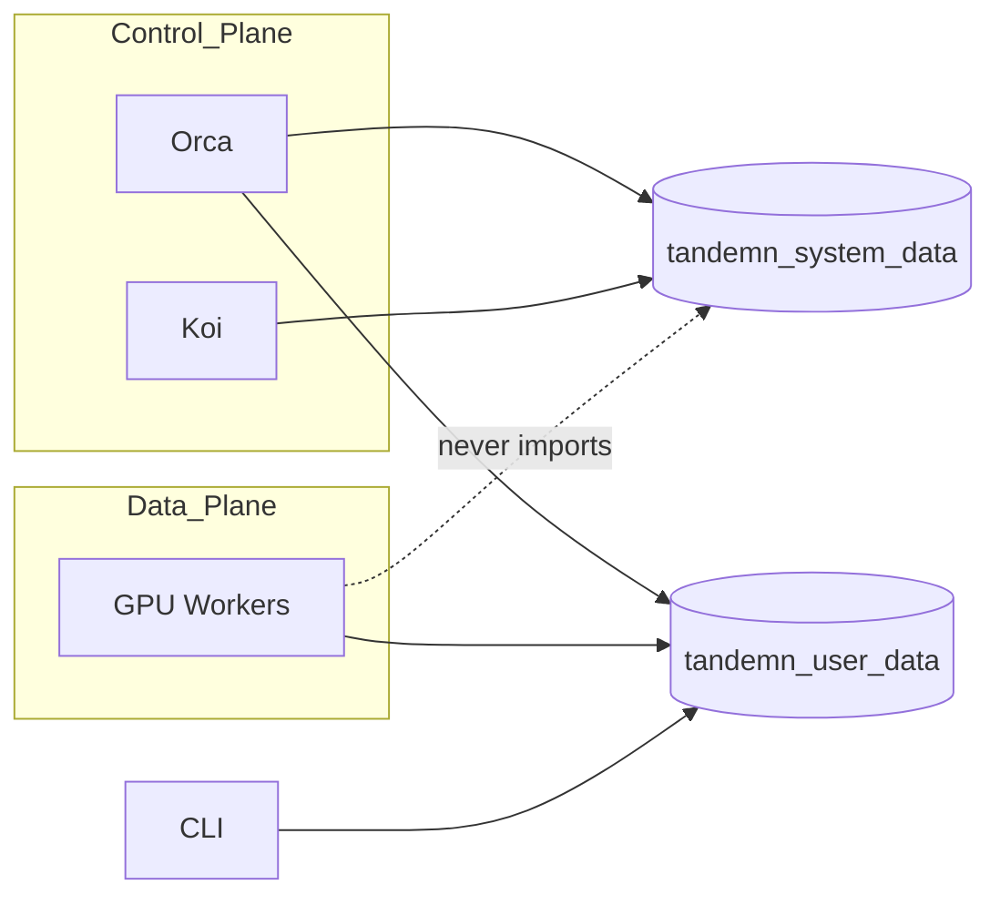
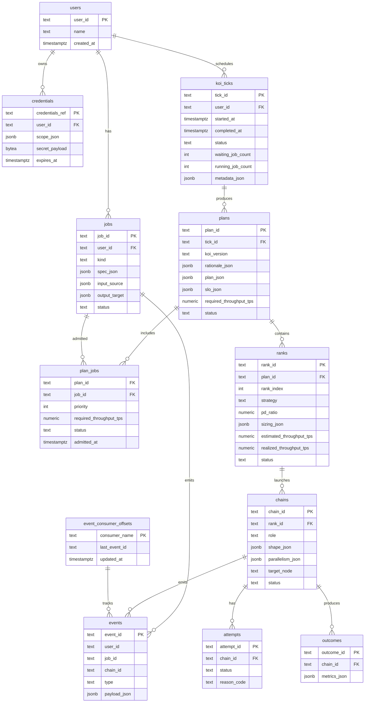
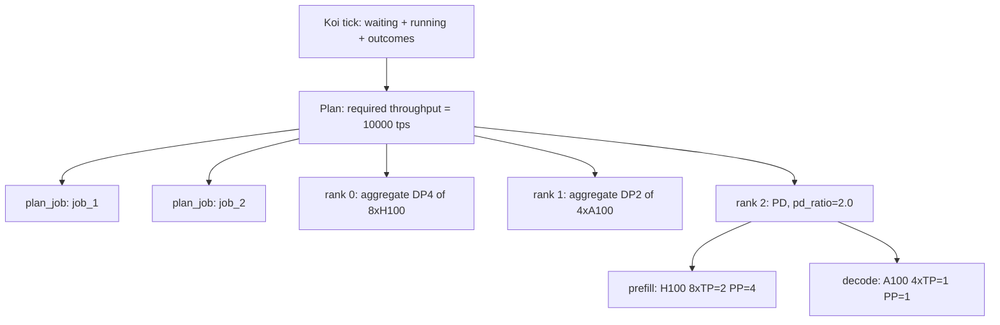
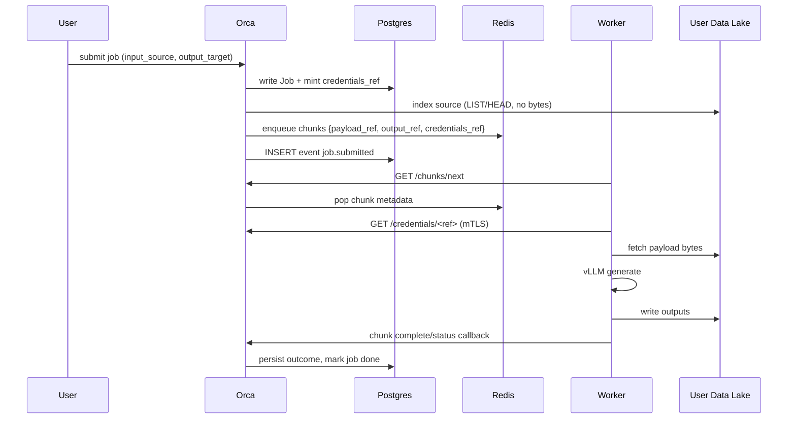
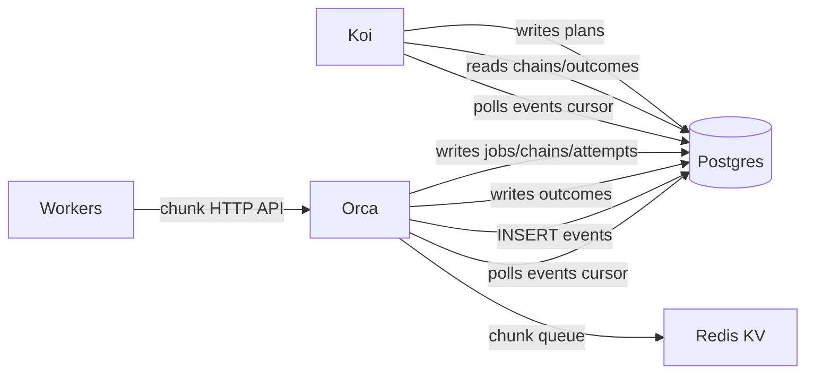
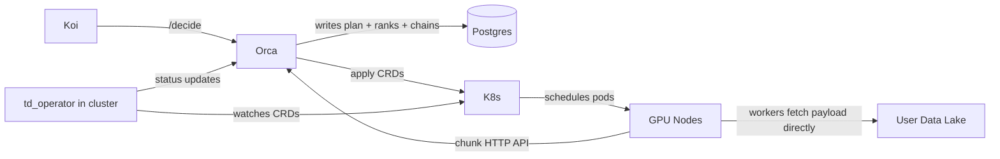

# Tandemn Data Architecture

This document describes how Tandemn stores, moves, and shares data
across its services. It is written from first principles. No history,
no migration narrative — just the model.

Tandemn is a control plane for LLM inference. Two services do the work:

- **Koi** — the brain. Computes placement plans and learns from outcomes.
- **Orca** — the executor. Launches chains, runs batch and online inference, records what happened.

Plus the workers (vLLM processes on GPU nodes) and the user's data systems
(S3, Snowflake, BigQuery, on-prem object stores, etc.).

The data architecture exists so these pieces share the same truth without
stepping on each other.

---

## 1. Principles

1. **One source of truth.** Canonical entities live in Postgres. Everything else (Redis, S3, logs, metrics) references those rows.
2. **Two libraries, not one.** User data and system data have different consumers, different security models, and different release cadences. Keep them separate.
3. **Workers are dumb.** Workers process chunks. They do not hold canonical state, do not query Postgres, and do not hold long-lived customer credentials.
4. **Data does not transit Orca.** Orca emits pointers; workers fetch bytes directly from the user's data system.
5. **Postgres is the source of truth and event log.** Events are rows in Postgres. Koi/Orca consume them by cursor/polling; Redis Streams are not required for the MVP.
6. **No new tables for new sources.** A new data lake connector is one PR, zero schema migrations.

---

## 2. The Two Libraries



### `tandemn_system_data` — canonical state

Owns: Postgres models, SQLAlchemy ORM, Alembic migrations, event log,
IDs, event envelope, Tandemn-owned S3 blob client.

Imported by **Orca and Koi only**. Workers never import it.

### `tandemn_user_data` — user payloads in motion

Owns: `PayloadRef` / `OutputRef` / `NormalizedRecord` types, connector
protocol, connectors (`S3Connector`, future
Snowflake/BigQuery/GCS/Azure/Kafka/etc.), credential resolver (workers)
and credential issuer (Orca).

Imported by **Orca, workers, and CLI**.

The split is enforced in CI (`import-linter`) so a worker module can't
accidentally pull in `tandemn_system_data`.

---

## 3. Storage Substrates

Each substrate has one job and is chosen for what it's good at.

| Substrate          | Role                                            | CAP        |
|--------------------|-------------------------------------------------|------------|
| Postgres           | Canonical spine. All entity rows, audit log.    | CP         |
| Postgres events    | Durable event log and consumer cursors.         | CP         |
| Redis KV           | Optional hot chunk queue for distributed workers. | AP      |
| S3 / MinIO         | Blobs: Tandemn-owned artifacts; staging.        | AP + strong RAW |
| User data systems  | Source/sink for inference inputs and outputs.   | n/a (theirs)|

The mental model: **truth and events live in Postgres; hot chunk queues may
live in Redis; bytes live in S3 or in the user's lake.**

---

## 4. Canonical Hierarchy

```
user_id
  └── job_id

koi_tick_id              (Koi's periodic scheduling cycle)
  └── plan_id            (multi-job scheduler plan)
        └── plan_job     (jobs admitted into this plan)
        └── rank_id      (ordered deployable capacity unit)
              └── chain_id             (role: prefill | decode | aggregate)
                    └── attempt_id
                          └── event_id
```

A `job_group` is the **derived** union of running chains across ranks whose
cumulative decode-side throughput meets the plan's required throughput. Never
stored; always queried.

---

## 5. The Spine (Postgres)



Key column notes:

- `jobs.input_source` and `jobs.output_target` are JSONB. They describe
  *where* user data lives, never the data itself.
- A `koi_tick` records one scheduler pass over waiting/running jobs and past
  outcomes. Koi runs this roughly every 100 seconds.
- A `plan` is a multi-job scheduler plan produced by a Koi tick. It contains
  Koi's rationale and executable rank structure (`plan_json` + `slo_json`).
- `plan_jobs` is the join table that records which jobs were admitted into a
  plan and what throughput/priority each contributed.
- `ranks.pd_ratio` is `prefill_per_decode`
  (e.g. `2.0` = 2 prefill chains per 1 decode chain). `NULL` for `aggregate`.
- `ranks.sizing_json` carries `{prefill: {shape}, decode: {shape, target_chains, est_tps_per_chain}}` (or `{aggregate: {...}}`).
  Prefill has no throughput field — SLO is decode-side only.
- `chains.shape_json` is copied from the rank's sizing at launch.
  Prefill and decode chains in the same rank may have different hardware.
- `chain_groups` is intentionally **not** a table. With one shape per role per rank, group-level info collapses into `sizing_json`.
- `credentials.secret_payload` is encrypted at rest. Workers never read this table directly.
- `event_consumer_offsets` tracks each consumer's cursor into the Postgres
  event log. Consumers update their cursor only after successful processing.

---

## 6. Koi Ticks and Rank Traversal

Koi runs a scheduler tick roughly every 100 seconds. Each tick looks at:

- waiting jobs
- running jobs
- recent outcomes
- the current resource map (Orca's live in-memory view, read via GET /resource-map)

Waiting and running jobs come from Postgres through `JobStore`
(`tandemn_system_data.clients`): waiting = `submitted`; running =
`launching` + `running`, each with the active chains serving it. The
resource map is **not** a Postgres table: Orca's reconciler is its
single writer, holds it in process memory, and serves versioned
snapshots (`ResourceMap` in `tandemn_system_data.models`) so readers
can detect staleness. If Orca goes multi-replica, the map moves to a
Postgres JSONB row with the same shape.

It produces one multi-job `plan` with ordered `ranks`. A rank is a deployable
capacity unit, such as `DP4 of 8xH100`. Orca deploys ranks in order and checks
realized cumulative throughput after each rank. It keeps deploying ranks until
the plan's required throughput is met or all ranks are exhausted.



Orca's `placement_executor`:

1. Read ranks in `rank_index` order.
2. Deploy the next rank.
3. Measure realized decode/aggregate throughput from the rank's chains.
4. Add realized throughput to the plan total.
5. If cumulative throughput meets required throughput, stop and emit `plan.throughput_met`.
6. If not, deploy the next rank.
7. If all ranks are exhausted, emit `plan.exhausted`.

**Throughput math is decode-side only.** Prefill chains exist to feed decode,
not to count toward the SLO sum.

---

## 7. User Data Path

User data never transits Orca during execution.



Two type-level constructs:

```
PayloadRef       = { type, uri, byte_range?, format, credentials_ref }
OutputRef        = { type, uri, format, credentials_ref }
NormalizedRecord = { input_id, user_id, job_id, prompt, metadata }
```

The connector framework (`tandemn_user_data/connectors/`) is the only
place that knows about S3, Snowflake, GCS, etc. Everything downstream
sees `NormalizedRecord`s and `PayloadRef`s.

Workers resolve `credentials_ref` to short-lived, scoped tokens via a
narrow Orca endpoint. They **never** hold long-lived customer credentials.

---

## 8. Communication and Shared Memory

Services do not call each other directly for state-bearing operations.
They share state through the spine and notify each other through events.



### Shared memory (Postgres)

Every entity Orca or Koi cares about exists as a Postgres row with a
canonical ID. To learn what's true, a service reads. To change what's
true, a service writes a row. No service holds canonical state in
local memory.

### Event log (Postgres)

When state changes, the writer inserts an event row into Postgres. Koi
and Orca consume events by reading rows after their own cursor in
`event_consumer_offsets`. If Koi is down when Orca records `chain.failed`,
the row remains in Postgres and Koi catches up when it restarts.

Postgres is both the durable audit log and the MVP delivery mechanism.
Redis Streams can be added later if event latency, fanout, or consumer
group scaling requires it.

### Work queue (Redis KV)

The chunk queue stays Redis-backed, but workers do not talk to Redis
directly. Workers call Orca's chunk HTTP API; Orca uses Redis internally
for queue state. The queue holds metadata, not bytes.

### What replaces webhooks

Old direct webhook calls (`/job/complete`, `/job/replica-failed`,
`/job/config-attempted`) become event rows in Postgres. The
webhook endpoints survive as thin shims that translate inbound HTTP to
canonical events, for any client that still posts to them.

---

## 9. Event Catalog (MVP)

```
job.submitted          job.completed          job.failed
tick.started           tick.completed
plan.created           plan.throughput_met       plan.exhausted
rank.started           rank.realized             rank.completed
rank.failed
job_group.assembled
chain.attempt_started  chain.failed          chain.completed
ratio.violated
outcome.recorded
```

Each event carries the canonical IDs (`user_id`, `job_id`,
`chain_id?`) plus a typed payload. Consumers are idempotent on
`event_id`.

---

## 10. Kubernetes Migration — and why nothing here changes

Tandemn is moving from SkyPilot/bare-metal launches to Kubernetes. A
new component, **`td_operator`**, runs inside the customer's cluster
(EKS / GKE / OKE / on-prem k8s) and reconciles **Tandemn Custom
Resources** into running pods (vLLM workers).



What changes:

- **Launching mechanism.** Orca no longer calls SkyPilot. It writes a `TandemnChain` (or `TandemnLaunchGroup`) CRD per chain into the target cluster's API server. `td_operator` reconciles those into pods.
- **Failure detection.** Operator watches pod state and reports back via the same `chain.attempt_started` / `chain.failed` / `chain.completed` events. The watchdog logic moves out of Orca and into the operator for k8s-managed chains.

What does **not** change:

- **Canonical data model.** `chains`, `ranks`, `attempts`, `outcomes`, `events`, `credentials` — all unchanged. A `chain_id` is still the row in Postgres; the CRD references it by name.
- **The two libraries.** `tandemn_system_data` and `tandemn_user_data` are identical. The operator imports `tandemn_user_data` to fetch user data on the worker side, same as the SkyPilot workers do today.
- **User data path.** Workers (now pods) still fetch directly from the user's data lake via `payload_ref` + `credentials_ref`. The kubelet doesn't see customer credentials; the pod resolves them at fetch time.
- **Event flow.** Postgres events still carry placement and chain events. Whether the chain runs in a VM (SkyPilot) or a pod (k8s) is invisible to consumers.
- **Spine queries.** "Show me everything about `job_xyz`" returns the same shape, with `chains.target_node` resolving to a pod name + node instead of a VM hostname.

In other words, the Kubernetes migration is a **launcher swap**, not a
data model change. The data architecture in this document is the
contract; SkyPilot and `td_operator` are interchangeable implementations
of "make the chain real."

---

## 11. Out of Scope

These are deliberately deferred:

- TSDB for time-series metrics (Prometheus counters suffice for now).
- Vector DB / pgvector for theories.
- Multi-region store and full RBAC.
- Real STS / KMS / Vault integration for credential minting (dev-mode tokens for now).
- Connectors beyond `S3Connector`. (GCS, Azure, Snowflake, BigQuery, Databricks, Iceberg, Kafka, SFTP, SQL sources come later, one PR each.)
- Sidecar / VPC-mode connector execution.
- Pre-sharding non-blob sources (Snowflake → S3 staging via `presharder.py`).

Each is additive. None require schema changes.

---

## 12. Summary

- Postgres holds the canonical spine. Every entity has a typed ID and a row.
- Postgres `events` is both the durable audit log and MVP event delivery path.
- Redis KV may hold the hot chunk queue when we need distributed worker coordination.
- S3/MinIO holds Tandemn-owned blobs only. User data stays in the user's systems.
- Two libraries: `tandemn_system_data` for canonical state, `tandemn_user_data` for user payloads. Workers see only the second.
- Placement is ordered fallback alternatives; SLO arithmetic is decode-side; prefill is ratio-driven, not throughput-counted.
- The Kubernetes migration replaces SkyPilot with `td_operator` + CRDs without touching the data model.

This is the contract. Code that respects it composes; code that breaks
it should not land.
