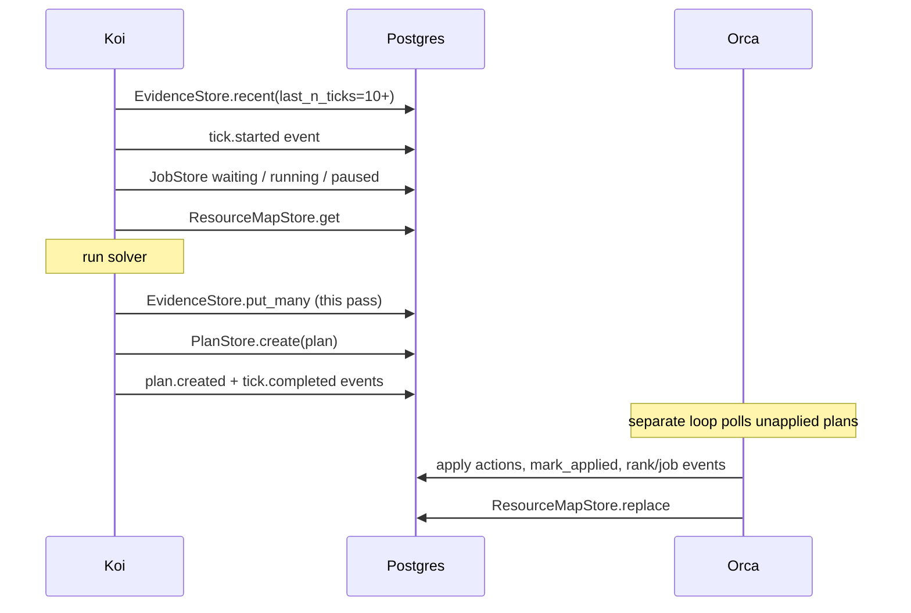

# Koi integration guide

Koi integrates through **`tandemn_system_data` only** — Postgres for all reads
and writes (jobs, plans, evidence, resource map, events). No HTTP between Koi
and Orca, no webhooks for MVP, no `tandemn_user_data` (Koi never touches user
bytes).

---

## Division of labor

| Responsibility | Koi | Orca |
|---|---|---|
| Read job queue state | `JobStore` reads | `JobStore` writes |
| Read tick history | `EvidenceStore.recent` | — |
| Decide placement | solver → `Plan` | — |
| Hand off decision | `PlanStore.create` | `PlanStore.unapplied` → apply → `mark_applied` |
| Persist learning evidence | `EvidenceStore.put` / `put_many` | — |
| Causal graph + confidence | `CausalGraphStore` load/sync | — |
| Launch ranks / transition jobs | — | `JobStore.launch_ranks`, `transition` |
| Resource map | `ResourceMapStore.get` (read) | `ResourceMapStore.replace` (write) |
| Events | write tick/plan events; consume for learning | write job/rank events |

Koi is a **writer of plans and evidence** and a **reader of everything else**.
Orca is the **executor**.

---

## What Koi imports

```python
from tandemn_system_data.clients import (
    PostgresClient,
    JobStore,
    PlanStore,
    EvidenceStore,
    CausalGraphStore,
    PostgresEventLog,
    ResourceMapStore,
)
from tandemn_system_data.models import (
    Plan,
    PlanAction,
    ActionType,
    Event,
    EvidenceRow,
    format_evidence_row_id,
)
from tandemn_system_data import events
from tandemn_system_data.ids import new_koi_tick_id, new_event_id, new_plan_id
```

Add `tandemn-store` to Koi's `pyproject.toml`. Use the same Postgres as Orca
(`TANDEMN_POSTGRES_URL`).

---

## Tick semantics

- **Trigger:** whenever Koi decides the cluster needs a new decision — after
  relevant events, on a backstop timer, or on demand. Not a fixed cadence.
- **Output:** every pass produces exactly one `Plan` with `status="created"`.
  No-op ticks use `keep` / `defer` for all jobs considered.
- **Two tick IDs:**
  - `tick_id` (`new_koi_tick_id()`) — event correlation only (`tick.started`,
    `plan.created`, `tick.completed`). Not a Postgres table.
  - `tick: int` on `EvidenceRow` — Koi's FSM counter for learning/replay.

---

## The tick loop



### 1. Gather inputs

```python
pg = PostgresClient()
jobs = JobStore(pg)
evidence = EvidenceStore(pg)

history = evidence.recent(user_id, last_n_ticks=10)  # CUSUM / ICP / surrogate input
waiting = jobs.waiting_jobs(user_id)
running = jobs.running_jobs(user_id)   # RunningJob: job + active ranks
paused = jobs.paused_jobs(user_id)
resource_map = ResourceMapStore(pg, user_id=user_id).get()
capacity = resource_map.scheduling_summary()  # env_key -> {total, gpu_type, pools: [...], ...}
```

`running_jobs` is the important job read — each `RunningJob` has `job` plus
active `RankAllocation`s (launching/running only). See
`src/tandemn_system_data/clients/jobs.py`.

Resource map shape: hierarchical `ResourceMap.clouds` (cloud → region → zone
→ network fabric → machine pool). Each `MachinePool` has `total_instances`,
`gpus_per_instance`, `gpu_type`, and optional `price_per_instance_hour`. Row
columns `version` / `updated_at` plus `pools_json` `{market, clouds}` in
Postgres. Total capacity only — infer free capacity from `running_jobs`.
`scheduling_summary()` env_key is `market|cloud|region|zone|gpu_type`; pools
sharing a key are aggregated (`total` sums) with per-pool detail in `pools`.
See `src/tandemn_system_data/models/resource_map.py`.

**Orca dependency:** until Orca wires the reconciler to call
`ResourceMapStore.replace` on place/preempt/swap/finish, the row may be empty
(`version=0`, no clouds). Koi may also derive hints from `running_jobs` ranks
only.

### 2. Optionally consume events

```python
log = PostgresEventLog(pg)
new_events = log.read_for_consumer("koi", types={"rank.failed", "job.finished"})
# idempotent on event_id
if new_events:
    log.ack("koi", new_events[-1].event_id)
```

Event catalog: `src/tandemn_system_data/events.py` (`ALL_EVENT_TYPES`,
typed payloads via `validate_payload`).

Events can also **trigger** a tick (e.g. `job.submitted`, `rank.failed`).

### 3. Run solver → build a `Plan`

One plan per pass, one action per job considered (including all-`keep` passes):

```python
plan = Plan(
    user_id=user_id,
    koi_version="koi-0.1.0",
    tick_rationale="...",
    actions=[
        PlanAction(
            job_id="job_B",
            type=ActionType.PLACE,
            ladder=[
                {"prefill": {"gpu": "H100", "count": 8, "n_replicas": 2}},
                {"decode":  {"gpu": "A100", "count": 8, "n_replicas": 1}},
            ],
            target_tps=1500.0,
        ),
        PlanAction(job_id="job_C", type=ActionType.KEEP),
        PlanAction(job_id="job_D", type=ActionType.DEFER),
        PlanAction(job_id="job_E", type=ActionType.PREEMPT),
    ],
    status="created",
)
```

**Pin the `ladder` JSON shape with Orca** — opaque JSONB in Postgres. See
`DATA_ARCHITECTURE.md` §6.

### 4. Persist evidence

After the solver, write one `EvidenceRow` per `(fsm_tick, job, rank)` evaluated:

```python
rows = [
    EvidenceRow(
        row_id=format_evidence_row_id(fsm_tick, job_id, rank_id),
        tick=fsm_tick,
        deploy_timestamp_utc=time.time(),
        job_id=job_id,
        rank_id=rank_id,
        env_label=("reserved", "aws", "us-east-1", "use1-az1", "H100"),
        X={...},
        # trajectories, CUSUM/ICP snapshots, etc.
    ),
    ...
]
evidence.put_many(user_id, rows)
```

Heavy fields serialize into `evidence_rows.payload_json` (JSONB). See
`src/tandemn_system_data/models/evidence.py` and `clients/evidence_store.py`.

### 4b. Causal graph (boot + end-of-tick sync)

At boot, load topology and confidence from Postgres (seed from JSON once if
`CausalGraphStore.is_empty()`):

```python
graph = CausalGraphStore(pg, user_id=user_id)
nodes = graph.load_nodes()
edges, edge_meta = graph.load_edges()
mechanisms, mech_meta = graph.load_mechanisms()
```

After S3 confidence updates within a tick, flush metadata back:

```python
graph.sync_edge_metadata(edge_meta)
graph.sync_mechanisms(mechanisms, mech_meta)
```

Topology bulk import uses `replace_nodes` / `replace_edges` only at seed
time. Not an Orca handoff surface.

### 5. Persist plan + emit events

```python
tick_id = new_koi_tick_id()

log.append(Event(
    event_id=new_event_id(),
    user_id=user_id,
    type="tick.started",
    payload_json=events.TickStartedPayload(
        tick_id=tick_id,
        user_id=user_id,
        waiting_job_count=len(waiting),
        running_job_count=len(running),
    ).model_dump(),
))

PlanStore(pg).create(plan)

log.append(Event(
    event_id=new_event_id(),
    user_id=user_id,
    type="plan.created",
    payload_json=events.PlanCreatedPayload(
        plan_id=plan.plan_id,
        user_id=user_id,
        tick_id=tick_id,
        actions={a.job_id: a.type for a in plan.actions},
    ).model_dump(),
))

log.append(Event(
    event_id=new_event_id(),
    user_id=user_id,
    type="tick.completed",
    payload_json=events.TickCompletedPayload(
        tick_id=tick_id,
        user_id=user_id,
        plan_id=plan.plan_id,
    ).model_dump(),
))
```

Koi does **not** call `mark_applied` — Orca does after applying the plan.

---

## What Koi must NOT do

- `JobStore.submit`, `transition`, `launch_ranks`, `set_rank_status` — Orca only
- `PlanStore.mark_applied` — Orca only
- `ResourceMapStore.replace` — Orca reconciler only
- `CredentialStore.put` — Orca only
- Import `tandemn_user_data` — not needed for scheduling

---

## Orca side (what Koi depends on)

Orca runs a separate apply-plan loop (`tandemn-system`):

```python
for plan in PlanStore(pg).unapplied(user_id):
    for action in plan.actions:
        match action.type:
            case ActionType.PLACE:   # waiting|paused → running + launch_ranks
            case ActionType.PREEMPT: # running → paused + tear down ranks
            case ActionType.SWAP:    # relaunch on new ladder
            case ActionType.KEEP | ActionType.DEFER:
                pass
    PlanStore(pg).mark_applied(plan.plan_id)
    # ResourceMapStore.replace(...) after reservation changes
```

See `src/tandemn_system_data/clients/plans.py`.

Orca must also:

1. Mount `create_credentials_app` (workers only — not Koi)
2. Emit job/rank lifecycle events Koi consumes
3. Update the resource map reconciler on place/preempt/swap/finish

---

## If Koi is not Python

**Plans** — insert into `plans`:

| Column | Value |
|---|---|
| `plan_id` | `plan_<ulid>` |
| `user_id` | tenant |
| `koi_version` | version string |
| `tick_rationale` | text |
| `actions_json` | JSON array (`PlanAction` shape) |
| `status` | `"created"` |
| `created_at` | timestamptz |

**Evidence** — insert into `evidence_rows` (indexed columns + `payload_json`).

**Resource map** — read `resource_maps` for the tenant (`pools_json` +
`version`). Wire shape is hierarchical; use `ResourceMap.scheduling_summary()`
for flat GPU counts.

**Causal graph** — read/write `koi_causal_*` via `CausalGraphStore`.

**Events** — `INSERT INTO events` with payloads from `events.py`.

---

## Minimal skeleton

```python
def run_tick(user_id: str, fsm_tick: int) -> None:
    pg = PostgresClient()
    jobs = JobStore(pg)
    plans = PlanStore(pg)
    evidence = EvidenceStore(pg)
    log = PostgresEventLog(pg)

    history = evidence.recent(user_id, last_n_ticks=10)
    waiting = jobs.waiting_jobs(user_id)
    running = jobs.running_jobs(user_id)
    paused = jobs.paused_jobs(user_id)
    rm = ResourceMapStore(pg, user_id=user_id).get()
    capacity = rm.scheduling_summary()

    tick_id = new_koi_tick_id()
    # emit tick.started

    plan, new_evidence_rows = solver(
        history, waiting, running, paused, rm, capacity, fsm_tick=fsm_tick
    )

    evidence.put_many(user_id, new_evidence_rows)
    plans.create(plan)

    # emit plan.created, tick.completed
```

---

## Contract checklist

1. Read last N ticks from `EvidenceStore.recent`
2. Read `waiting` / `running`+ranks / `paused` from `JobStore`
3. Read resource map from Postgres (`ResourceMapStore.get`); flatten with
   `scheduling_summary()` for placement checks
4. Optionally consume events (also valid tick triggers)
5. Write `EvidenceRow`s for this pass
6. Write one `Plan` with `status="created"` every pass
7. Emit `tick.started`, `plan.created`, `tick.completed`
8. Agree `ladder` JSON shape with Orca
9. Sync causal graph metadata after S3 confidence updates
10. Never mutate jobs/ranks/resource map directly

Tests: `tests/test_spine_integration.py` (`test_plan_handoff_and_gang_launch`,
`test_evidence_store_recent_ticks`, `test_resource_map_store_postgres`,
`test_causal_graph_store_postgres`). Unit: `tests/test_resource_map.py`.

---

## `tandemn-intelligence` cutover

The algorithm stack (FSM, agent, learning) stays in intelligence. Wire three
adapters to this contract — do not copy pseudo-code into `tandemn-store`:

| Intelligence seam | Replace with |
|---|---|
| `ResourceMapManager` raw SQL | `JobStore` + `ResourceMapStore.get` + `scheduling_summary()` |
| `EvidenceService` in-memory dict | `EvidenceStore` (+ local index wrapper if needed) |
| In-memory causal graph | `CausalGraphStore` (JSON seed once, Postgres source of truth) |
| `Executor.send_to_executor` | `PlanStore.create` + `PostgresEventLog` events |

Intelligence-only (no store import): telemetry, slow loop, confidence service,
agent tools, plan validation before write.
